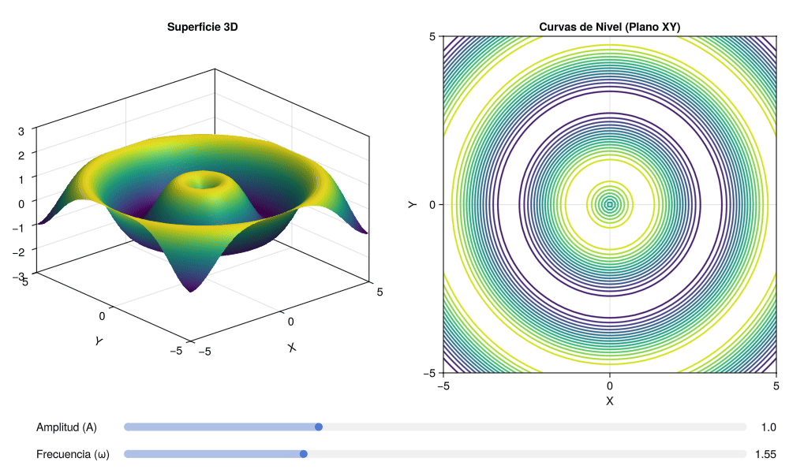

# Algunos temas de Cálculo multivariable con Julia

Este repositorio contiene scripts en **Julia** para la visualización de superficies tridimensionales, curvas de nivel y animaciones interactivas aplicadas al estudio del Cálculo Multivariable (Cálculo 3).

**Autor:** Miguel Ángel Chávez García ([@Miguelangel25Chg](https://github.com/Miguelangel25Chg))  
**Institución:** FES Acatlán, UNAM

Este repositorio contiene scripts en **Julia** para la visualización de superficies

---

## 📁 Estructura del Repositorio
# 1. Funciones $f:\mathbb R^2\to \mathbb R.$ Gráficas y curvas de nivel

* `graficas_curvas_nivel.jl`: Script con gráficos estáticos de superficies y mapas de contorno 2D usando el paquete `Plots`.
* `animcacion_varias_variables.jl`: Script interactivo y de animación reactiva con controles deslizantes usando `GLMakie`.
* `superficie.png`: Captura generada de la superficie 3D.
* `superficie_animada.gif`: Animación exportada de la variación de la superficie y rotación de cámara.
* 

---

## 🛠️ Requisitos e Instalación

Para ejecutar los archivos `.jl`, asegúrate de tener instalado [Julia](https://julialang.org/) y agregar los paquetes necesarios desde la consola (REPL):

```julia
using Pkg
Pkg.add(["Plots", "GLMakie"])

